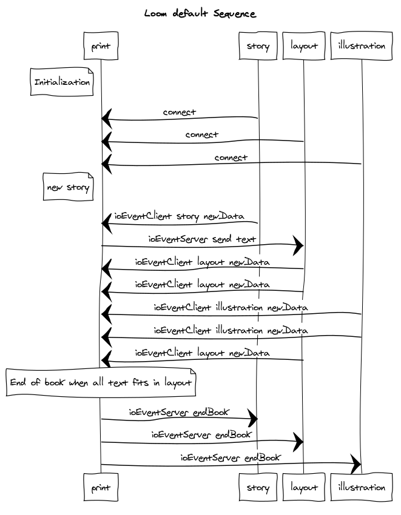

## socket events to emit

### story

#### from socket server

1. on server send text
```javascript
/**
 * textFromServer: string of text to layout
 */
socket.on("ioEventServer_send_newStory", () => {
  
})
```

#### to socket server

1. on connected to socket
```javascript
socket.on("connect", () => {
  socket.emit("ioEventClient_connection_story")
})
```

2. on data created
```javascript

/**
 * text: new text generated
 * @type {{text: string}}
 */
const data = {
  text: text,
}    
socket.emit("ioEventClient_story_newData", data)
```

-------------------------

### layout

#### from socket server

1. on server send text
```javascript
/**
 * textFromServer: string of text to layout
 */
socket.on("ioEventServer_send_text", (textFromServer) => {
  
})
```

#### to socket server
1. on connected to socket
```javascript
socket.on("connect", () => {
  socket.emit("ioEventClient_connection_layout")
})
```

2. on data created
```javascript
/**
 * svg: string of svg element, unconsumedText: text not used for layout
 * @type {{svg: string, unconsumedText: string}}
 */
const data = {
  unconsumedText: unconsumedText,
  svg: svg,
}    
socket.emit("ioEventClient_layout_newData", data)
```

-------------------------

### illustration

#### from socket server

…

#### to socket server
1. on connected to socket
```javascript
socket.on("connect", () => {
  socket.emit("ioEventClient_connection_illustration")
})
```

2. on data created
```javascript

const dataURL = canvas.toDataURL(); 

/**
 * imgBase64: data URL from canvas, for get image
 * @type {{imgBase64: string}}
 */
const data = {
  imgBase64: dataURL,
}    
socket.emit("ioEventClient_illustration_newData", data)
```

## Loom default sequence



Copy-paste this code on https://www.websequencediagrams.com/ to generate the diagram


```
title Loom default Sequence

note left of print: Initialization

story->print:connect
layout->print:connect
illustration->print:connect

note left of print: new story
story->print:ioEventClient_story_newData
print->layout:ioEventServer_send_text
layout->print:ioEventClient_layout_newData
layout->print:ioEventClient_layout_newData


illustration->print:ioEventClient_illustration_newData
illustration->print:ioEventClient_illustration_newData
layout->print:ioEventClient_layout_newData

note over print: End of book when all text fits in layout

print->story:ioEventServer_endBook
print->layout:ioEventServer_endBook
print->illustration:ioEventServer_endBook
```
